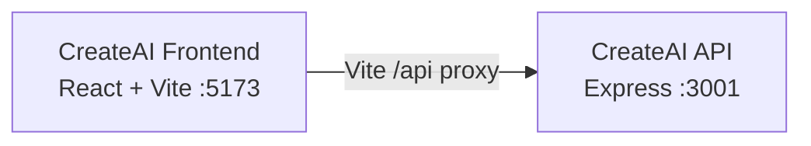

# Azure Debug Plan

> This plan is the source of truth for generating the
> VS Code debug setup in this workspace.
>
> **Status:** Planning
> **Execution Mode:** Guided
> **Created:** 2026-09-28T09:30:12+02:00
> **Last Updated:** 2026-09-28T09:30:12+02:00
>
> <!-- Guided Mode (default) - review and approval are required before generation. -->

---

## Prerequisites

| Tool / Extension | Category | Service(s) | Installed | Version |
|------------------|----------|------------|-----------|---------|
| Node.js | Runtime | * | ✅ | v22.19.0 |
| npm | Package manager | * | ✅ | 10.9.3 |
| Docker | Container runtime | backend, frontend | ❓ | CLI v29.2.1; engine not reachable |
| Docker Compose | Compose provider | backend, frontend | ✅ | v5.0.2 |
| Chrome | Browser | frontend | ✅ | 153.0.8010.53 |

> ⚠️ **Action required:** Docker Desktop's engine could not be reached during the check. Start Docker Desktop and confirm it is ready before using the Compose-based local stack. Node.js is not pinned by either service; the detected runtime is v22.19.0.

---

## Debug Configurations

Each checked row produces a VS Code debug configuration in `.vscode/launch.json`.

| Generate | Debug Config Name | Service Label | Service Root | Project Type | Runtime | Version | Azure Dependencies |
|----------|--------------------|---------------|--------------|--------------|---------|---------|---------------------|
| [x] | CreateAI API (debug) | CreateAI API | ./backend | app-service | node-js | 22.19.0 | — |
| [x] | CreateAI Frontend (debug) | CreateAI Frontend | ./frontend | frontend-spa | node-js | 22.19.0 | — |
| [x] | Debug All Services | Debug All Services | — | *Compound Config* | — | — | — |

Project Type Descriptions

| Project Type | Description |
|-------------|-------------|
| app-service | HTTP server application; this service uses Express. |
| frontend-spa | Single-page application served by a development server; this service uses React and Vite. |

> ℹ️ **Proxy detected:** CreateAI Frontend proxies `/api` requests to CreateAI API at `http://localhost:3001` via `frontend/vite.config.js`. The compound configuration should start the backend before the frontend.

---

## Orchestrator

| Orchestrator | Container Runtime | Compose Command | Description |
|-------------|-------------------|-----------------|-------------|
| Docker Compose | Docker | `docker compose` | Preserves the existing `docker-compose.yml` stack for the frontend and backend. Docker CLI is installed, but the engine was not reachable during planning; start Docker Desktop before running Compose. |

---

## Emulators

| Dependent Service | Emulator | Purpose |
|-------------------|----------|---------|
| — | None required | The app uses browser localStorage and has no Azure SDK or managed datastore dependency. |

---

## Architecture Diagram

During local debugging, the React/Vite frontend sends `/api` requests through its proxy to the Express backend; neither service requires an Azure emulator.

---

## API Test Collections

| Generate | Service | Description |
|----------|---------|-------------|
| [x] | CreateAI API | 

HTTP Endpoints (8)
 GET /api/health POST /api/content/generate POST /api/code/generate POST /api/prompts/optimize GET /api/prompts/templates GET /api/workflows POST /api/workflows/execute GET /api/history 
 |

---

## Convenience Scripts

No additional convenience scripts are requested. Existing root `npm test` and `npm run build` commands and each service's development command should be retained.